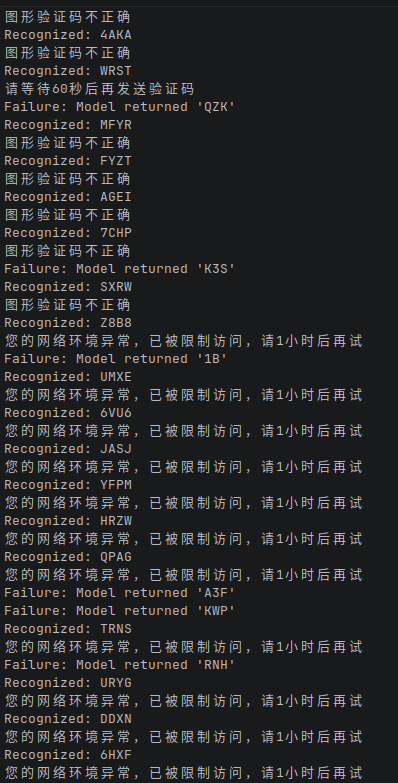
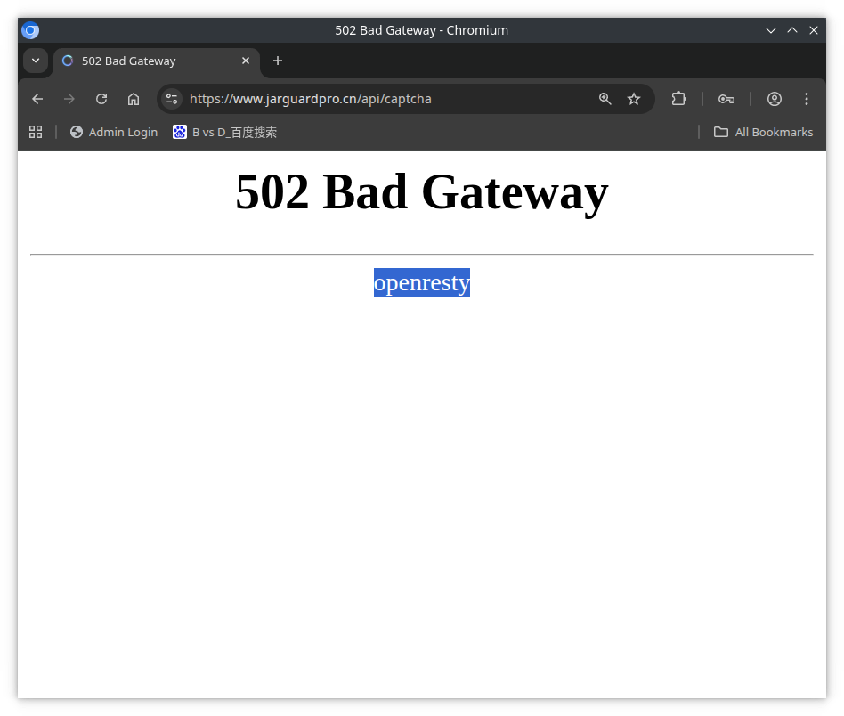

# 聂凌平我操你妈，软件全程vibe coding狗屎混淆还自称“Java OLLVM”，你妈死了！





# JarGuardPro 邮箱验证码自动化发送思路

~~[获取captcha\(返回图片\)](./readme_files/captcha.http) API Dead wait until it back online~~

验证码图片


# Note 聂凌平 has updated the response message text but I forgot to update them, I will update it if the captcha API back online.

[发送邮箱验证码\(API Dead\)](./readme_files/emailverify.http)

成功返回
```json
{"code":200,"message":"邮件发送成功，请查看邮箱","data":null}
```

验证码错误返回

```json
{"code":201,"message":"验证码不正确","data":null}
```

发送频率过高

```json
{"code":600,"message":"请等待60秒后再发送验证码","data":null}
```

注：一个验证码可以多次使用，也就是你*短时间内*emailverify email admin@gov.cn captcha cfcy，把email换成admin@google.com也行（code 但是201或者600就得重新识别验证码）。
注：目前你需要带好JSESSIONID cookie


Solving the captcha(Extract 4 characters from image):

Use `InternVL3-1B-Instruct-GGUF` or `glm-ocr`.
